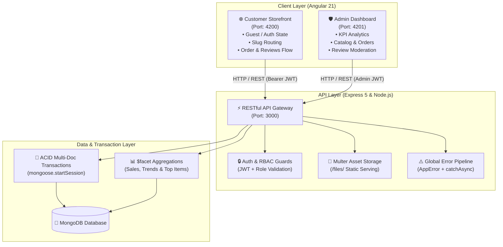

# 🛍️ Fashion Hub — Enterprise Full-Stack E-Commerce Platform

[](https://angular.dev/)
[](https://www.typescriptlang.org/)
[](https://nodejs.org/)
[](https://expressjs.com/)
[](https://www.mongodb.com/)
[](LICENSE)

> An enterprise-grade, full-lifecycle fashion e-commerce ecosystem engineered with **Angular 21** standalone storefront and administrative dashboard, powered by a high-performance **Node.js/Express 5** RESTful API with **MongoDB ACID Transactions**, intelligent cart synchronization, and business intelligence aggregation pipelines.

---

## 📑 Table of Contents

- [Overview](#-overview)
- [System Architecture](#-system-architecture)
- [Key Features & Highlights](#-key-features--highlights)
  - [Customer Storefront (`front-end/`)](#1-customer-storefront-front-end)
  - [Admin Dashboard (`admin/`)](#2-admin-dashboard-admin)
  - [RESTful Backend API (`back-end/`)](#3-restful-backend-api-back-end)
- [Repository Structure](#-repository-structure)
- [Getting Started](#-getting-started)
  - [Prerequisites](#prerequisites)
  - [Installation & Setup](#installation--setup)
  - [Environment Variables](#environment-variables)
- [Core API Reference](#-core-api-reference)
- [Security & Data Integrity](#-security--data-integrity)
- [Course & Academic Context](#-course--academic-context)
- [Author](#-author)

---

## 🌟 Overview

**Fashion Hub** is architected as a modular monorepo containing three interconnected applications:
1. **Customer Storefront (`front-end/`)**: A consumer shopping platform featuring deep category navigation, slug-based product routing, reactive guest/authenticated shopping carts, address management, and dynamic order checkout.
2. **Admin Operations Hub (`admin/`)**: A back-office administration portal providing real-time product catalogs, order lifecycle state machines, review moderation, stock tracking, and analytical reporting.
3. **High-Performance Core API (`back-end/`)**: An Express 5 REST API utilizing Mongoose 9, MongoDB ACID multi-document transactions, automated stock safety buffers, and multi-stage aggregation pipelines.

---

## 🏛️ System Architecture



---

## 🚀 Key Features & Highlights

### 1. Customer Storefront (`front-end/`)
* **Modern Angular 21 Architecture**: Built 100% on **Standalone Components**, utilizing Angular's native Control Flow syntax (`@if`, `@for`, `@empty`) for zero-overhead template rendering.
* **Hybrid Guest & Authenticated Cart**:
  * Unauthenticated users can browse and add products stored in browser `localStorage`.
  * Upon login or registration, the frontend triggers `POST /api/cart/sync`, merging local items seamlessly into the customer's database cart.
* **Semantic SEO-Friendly Slug Routing**:
  * Clean route URLs such as `/products/:categorySlug/:productSlug` for enhanced discoverability and UX.
* **Interactive Reviews & Rating Module**:
  * Reusable presentational components (`<app-review-card>`, `<app-review-list>`).
  * Self-service customer review modal in user profile with dynamic 5-star picker.
  * Real-time calculation of overall store rating score on the landing page.
* **Catalog Filtering & Instant Search**:
  * Subcategory filter pills, dynamic price slider, sorting (popularity, price, new arrivals), and keyword search parameter synchronization.

---

### 2. Admin Dashboard (`admin/`)
* **Smart & Presentational Decomposition**: Maintains strict separation between container pages and reusable presentational components.
* **Catalog Management**: Complete CRUD operations for Categories, Subcategories, and Products with multi-part file uploads (Multer).
* **Order State Machine**:
  * Tracks and advances orders across the full lifecycle: `pending` ➔ `processing` ➔ `shipped` ➔ `received` (or `cancelled` / `rejected`).
* **Review Moderation Portal**:
  * Moderation table displaying customer ratings and comments with instant one-click approval toggles (`isApproved`).
* **Interactive Analytics & Metrics**:
  * Real-time KPI summary cards (Total Revenue, Orders Placed, Pending Reviews, Low Stock Alerts).

---

### 3. RESTful Backend API (`back-end/`)
* **MongoDB ACID Multi-Document Transactions**:
  * Order placement executes within `mongoose.startSession()` and `session.startTransaction()`.
  * Atomic stock reduction prevents overselling in high-concurrency environments; automatically rolls back changes via `session.abortTransaction()` if any step fails.
* **Intelligent Cart State & Drift Protection**:
  * **Safety Stock Buffer (`STOCK_SAFETY_BUFFER = 3`)**: Protects against unexpected inventory runouts.
  * **Price & Stock Change Detection**: When a product price changes while in a user's cart, the engine moves the item into `changedItems` for user approval before checkout.
* **Advanced Aggregation Pipelines (`report.controller.js`)**:
  * Leverages `$facet`, `$unwind`, `$group`, `$lookup`, and `$project` to calculate top-performing products, top-spending customers, and yearly/monthly revenue curves.
* **Robust Error Handling**:
  * Centralized error middleware with operational `AppError` classification and automatic development stack traces vs. clean client-facing messages.

---

## 📁 Repository Structure

```text
E-commerce/
├── admin/                           # 🛡️ Angular 21 Admin Dashboard
│   ├── src/
│   │   ├── app/
│   │   │   ├── core/                # Admin services, guards, interceptors, models
│   │   │   ├── layout/              # Sidebar, Header, Admin Layout wrapper
│   │   │   └── pages/               # Feature pages (Products, Orders, Reviews, Reports)
│   │   └── environments/            # API base URL configuration
│   ├── angular.json
│   └── package.json
│
├── back-end/                        # ⚡ Express 5 & MongoDB REST API
│   ├── server.js                    # Entry point, route binding & static file server
│   ├── package.json
│   └── src/
│       ├── config/                  # MongoDB Mongoose connection
│       ├── controllers/             # 12 Domain Controllers (Auth, Cart, Purchase, Report, etc.)
│       ├── middlewares/             # Auth, Role RBAC, Pagination, Filters, Multer Upload, Errors
│       ├── models/                  # Mongoose Schemas (User, Cart, Product, Purchase, Review, etc.)
│       ├── routes/                  # Express Router definitions
│       ├── uploads/                 # Static media directory served at /files/
│       └── utils/                   # AppError, catchAsync, generateToken helpers
│
└── front-end/                       # 🌐 Angular 21 Customer Storefront
    ├── src/
    │   ├── app/
    │   │   ├── core/                # Core services, models, authGuard, authInterceptor
    │   │   └── layout/              # Feature views & layout modules
    │   │       ├── home/            # Storefront landing page
    │   │       ├── productslist/    # Filterable product catalog
    │   │       ├── productdetails/  # Single product view with image gallery
    │   │       ├── cart/            # Shopping cart management
    │   │       ├── order/           # Dynamic checkout & address selection
    │   │       ├── profile/         # Account hub & user review submission
    │   │       ├── review/          # Reusable ReviewCard & ReviewList components
    │   │       └── shared/          # Header navbar & footer
    │   └── environments/            # Client environment configurations
    ├── angular.json
    └── package.json
```

---

## 🛠️ Getting Started

### Prerequisites
- **Node.js**: `v20.x` or higher recommended
- **npm**: `v10.x` or higher
- **MongoDB**: Local MongoDB instance running on `localhost:27017` or MongoDB Atlas URI
- **Angular CLI**: Install globally with `npm install -g @angular/cli`

---

### Installation & Setup

#### 1. Clone the Repository
```bash
git clone https://github.com/Amr-Mahmoud293/fashion-ecommerce-app.git
cd fashion-ecommerce-app
```

#### 2. Start the Backend API
```bash
cd back-end
npm install

# Setup environment variables (create .env)
# Start development server with nodemon
npm run dev
```
> Server runs on: **`http://localhost:3000`**  
> Static files served at: **`http://localhost:3000/files/`**

#### 3. Start the Customer Storefront
```bash
cd ../front-end
npm install

# Start Angular development server
ng serve -o
```
> Storefront runs on: **`http://localhost:4200`**

#### 4. Start the Admin Dashboard
```bash
cd ../admin
npm install

# Start Admin portal on port 4201
ng serve --port 4201
```
> Admin Dashboard runs on: **`http://localhost:4201`**

---

### Environment Variables

#### Backend Configuration (`back-end/.env`)
Create a `.env` file in the `back-end/` root:
```env
PORT=3000
MONGODB_URI=mongodb://localhost:27017/ecommerce
SECRET_KEY=your_super_secret_jwt_key_here
NODE_ENV=development
```

#### Client Configuration (`front-end/src/environments/env.ts` & `admin/...`)
```typescript
export const environment = {
  production: false,
  apiURL: 'http://localhost:3000/api/',
  staticURL: 'http://localhost:3000/files/'
};
```

---

## 📡 Core API Reference

<details open>
<summary><b>Authentication & Users</b></summary>

| Method | Endpoint | Access | Description |
| :--- | :--- | :--- | :--- |
| `POST` | `/api/auth/signup` | Public | Registers a new user and auto-provisions a cart |
| `POST` | `/api/auth/login` | Public | Authenticates credentials and issues JWT token |
| `GET` | `/api/users/profile` | Authenticated | Retrieves current logged-in user profile |
| `PUT` | `/api/users/profile` | Authenticated | Updates personal information and addresses |
| `GET` | `/api/users` | Admin | Retrieves paginated user list |
| `PATCH`| `/api/users/:id/status` | Admin | Toggles user status (`active` / `blocked`) |

</details>

<details>
<summary><b>Products & Catalog</b></summary>

| Method | Endpoint | Access | Description |
| :--- | :--- | :--- | :--- |
| `GET` | `/api/product` | Public | Retrieves filtered & paginated product catalog |
| `GET` | `/api/product/:id` | Public | Retrieves single product details by ID |
| `GET` | `/api/product/:categorySlug/:productSlug` | Public | Retrieves product by SEO semantic slugs |
| `GET` | `/api/product/related/:id` | Public | Returns related category products |
| `POST` | `/api/product` | Admin | Creates a product with Multer image upload |
| `PUT` | `/api/product/:id` | Admin | Updates existing product details |
| `DELETE`| `/api/product/:id` | Admin | Soft-deletes a product (`isDeleted: true`) |

</details>

<details>
<summary><b>Cart & Synchronization</b></summary>

| Method | Endpoint | Access | Description |
| :--- | :--- | :--- | :--- |
| `GET` | `/api/cart` | Authenticated | Fetches user cart with stock & price validation |
| `POST` | `/api/cart/add` | Authenticated | Adds product item or increments quantity |
| `POST` | `/api/cart/sync` | Authenticated | Merges guest localStorage items into database cart |
| `POST` | `/api/cart/guest-validate` | Public | Validates guest items against live stock |
| `PUT` | `/api/cart/quantity` | Authenticated | Updates specific item quantity |
| `DELETE`| `/api/cart/:productId` | Authenticated | Removes single item from cart |
| `DELETE`| `/api/cart` | Authenticated | Clears all items from cart |

</details>

<details>
<summary><b>Orders & Checkout</b></summary>

| Method | Endpoint | Access | Description |
| :--- | :--- | :--- | :--- |
| `POST` | `/api/purchase` | Authenticated | **Atomic ACID Order Placement**: validates stock, deducts inventory, creates order |
| `GET` | `/api/purchase/my-orders` | Authenticated | Retrieves customer order history |
| `PATCH`| `/api/purchase/cancel/:id` | Authenticated | Customer self-service order cancellation |
| `GET` | `/api/purchase/admin` | Admin | Admin view of all customer orders |
| `PATCH`| `/api/purchase/:id/status` | Admin | Advances order status (`processing`, `shipped`, etc.) |

</details>

<details>
<summary><b>Reviews & Analytics</b></summary>

| Method | Endpoint | Access | Description |
| :--- | :--- | :--- | :--- |
| `GET` | `/api/reviews/active` | Public | Retrieves approved customer reviews for homepage |
| `GET` | `/api/reviews/my-review` | Authenticated | Fetches current user's review (or `data: null`) |
| `POST` | `/api/reviews/my-review` | Authenticated | Submits new review (sets `isApproved: false`) |
| `PATCH`| `/api/reviews/:id/toggle-approval` | Admin | One-click approval toggle for review moderation |
| `GET` | `/api/report/sales` | Admin | Executes MongoDB `$facet` aggregation analytics |

</details>

---

## 🔒 Security & Data Integrity

- **Password Hashing**: Salted hashing with **Bcrypt** (cost factor 12) through Mongoose `pre('save')` hooks.
- **Credential Protection**: Passwords configured with `select: false` to ensure sensitive hashes are excluded from API payloads by default.
- **JWT Authorization**: Stateless JSON Web Tokens passed via standard `Authorization: Bearer <token>` headers.
- **Role-Based Access Control (RBAC)**: Route-level protection enforcing `admin` privilege verification.
- **Account Enforcement**: Immediate token rejection if an account status is updated to `blocked`.
- **Concurrency & Atomicity**: MongoDB ACID transactions guarantee that product inventory is never oversold during concurrent checkout requests.

---

## 🎓 Course & Academic Context

This project was developed as a graduation task for the **NTI (National Telecommunication Institute)** Web Development Program. It demonstrates comprehensive full-stack engineering competency spanning advanced front-end architecture, backend data pipelines, and database transaction management.

---

## 👨‍💻 Author

**Amr Mahmoud** — Full-Stack Developer

---

## 📄 License

This project is licensed under the **MIT License** — see the [LICENSE](LICENSE) file for details.
